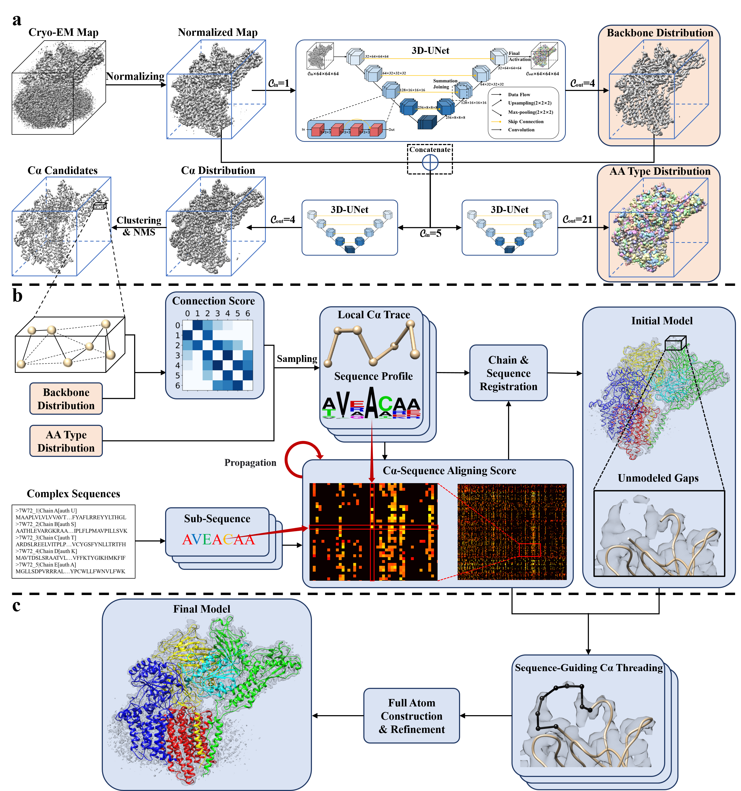

# EModelX
EModelX is a method for automatic cryo-EM protein complex structure modeling.

## Environment
`conda env create -f EModelX.yml`  
For EModelX(+AF), you may need to run AlphaFold following https://github.com/deepmind/alphafold or get AlphaFold-predicted single-chain structures from AlphaFoldDB (https://alphafold.ebi.ac.uk/).  

## Minimal Example: Modeling for new EM maps

For EModelX:   
`python run_com_modeling.py --protocol=temp_free --EM_map=./inputs/emd_32336.map.gz --fasta=./inputs/7w72.fasta --output_dir=./outputs`  
For EModelX(+AF):   
`python run_com_modeling.py --protocol=temp_flex --EM_map=./inputs/emd_32336.map.gz --fasta=./inputs/7w72.fasta --template_dir=./inputs/templates --output_dir=./outputs`   
, where you can replace `--EM_map` with your target EM map   
, and `--fasta` with your target fasta   
, and `--template_dir`: directory of the template folder, only needed when --protocol == temp_flex   
, and `--output_dir`: the output directory for modeling results  

Notice: If you want to run EModelX(+AF), please place your AlphaFold-predicted single-chain structures in your `--template_dir`， the format should follow our example in ./inputs/templates.  

## Web Server
EModelX's web server is accessible at
https://bio-web1.nscc-gz.cn/app/EModelX

